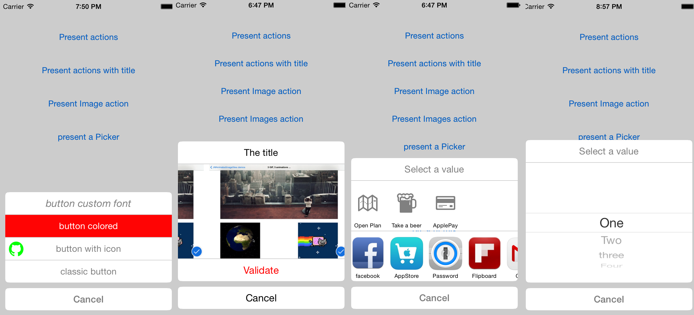
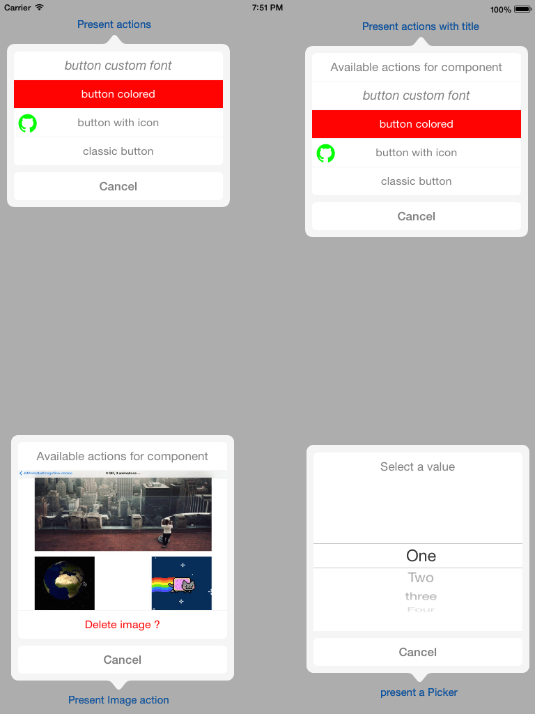
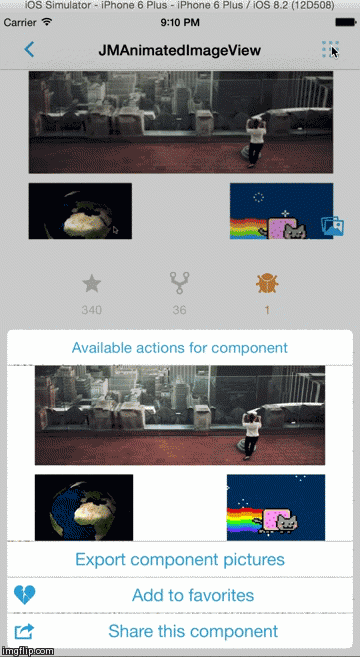
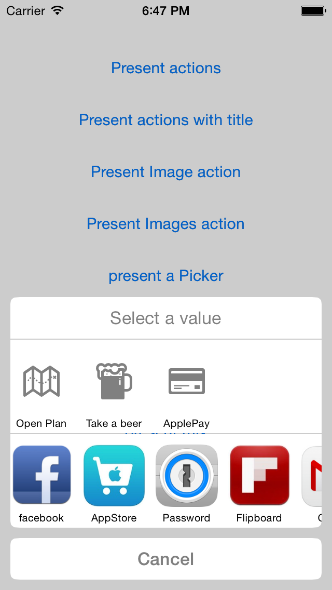
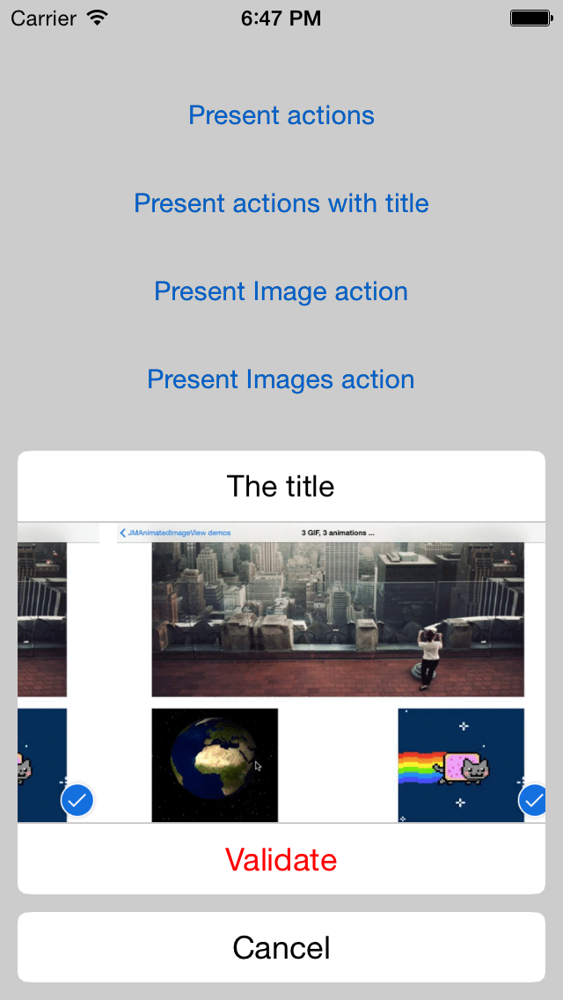
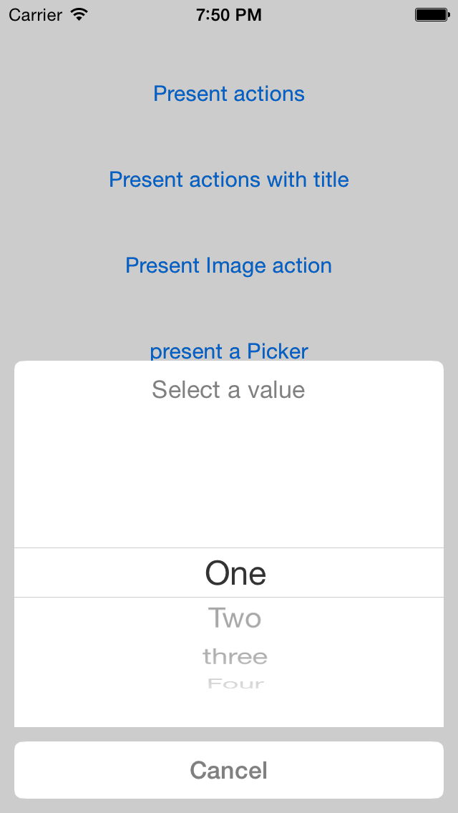

# JMActionSheetDescription

[](http://twitter.com/leverdeterre)
[](https://github.com/leverdeterre/PermissiveResearch/blob/master/LICENCE)
[](https://github.com/leverdeterre/PermissiveResearch)
[](http://cocoapods.org/pods/JMActionSheetDescription)

## Usage

To run the example project, clone the repo, and run `pod install` from the Example directory first.

## Screenshots









## Installation

JMActionSheetDescription is available through [CocoaPods](http://cocoapods.org). To install
it, simply add the following line to your Podfile:

```ruby
pod "JMActionSheetDescription"
```


```objective-c
//init your description
JMActionSheetDescription *desc = [[JMActionSheetDescription alloc] init];

//Configure your colors
desc.actionSheetTintColor = [UIColor grayColor];
desc.actionSheetCancelButtonFont = [UIFont boldSystemFontOfSize:17.0f];
desc.actionSheetOtherButtonFont = [UIFont systemFontOfSize:16.0f];

//Cancel item
JMActionSheetItem *cancelItem = [[JMActionSheetItem alloc] init];
cancelItem.title = @"Cancel";
desc.cancelItem = cancelItem;

//Can configure a context for your action .. an url ? image ? (work in progress)
JMActionContextItem *contextItem = [[JMActionContextItem alloc] init];
contextItem.image = [UIImage imageNamed:@"gif_experiments"];
contextItem.imageHeight = 200.0f;
desc.contextItem = contextItem;
desc.title = @"Available actions for component";

//item + block
JMActionSheetItem *itemShare = [[JMActionSheetItem alloc] init];
itemShare.title = @"last action";
itemShare.action = ^(void){
    NSLog(@"last action pressed");
};

//Pickeritem + block
JMActionSheetPickerItem *pickerItem = [[JMActionSheetPickerItem alloc] init];
    pickerItem.elements = @[@"One", @"Two", @"three", @"Four"];
    pickerItem.pickerAction = ^(NSString *selectedValue){
        NSLog(@"selectedValue %@",selectedValue);
    };

desc.items = @[itemShare,pickerItem];
[JMActionSheet showActionSheetDescription:desc inViewController:self];
```

## Shortcuts :)
### To present a picker (JMPickerActionSheet) 

```objective-c
[JMPickerActionSheet showPickerActionSheetElements:@[@"One", @"Two", @"three", @"Four"]
                                    didSelectBlock:^(NSString *selectedValue){
                                                    NSLog(@"selectedValue %@",selectedValue);}
                                            title:@"JMPickerActionSheet methods"
                                inViewController:self];
```

### Present a mutliple images choice (JMImagesActionSheet)

```objective-c
[JMImagesActionSheet showImagesActionSheetImages:@[
                        [UIImage imageNamed:@"gif_experiments"],
                        [UIImage imageNamed:@"gif_experiments"],
                        [UIImage imageNamed:@"gif_experiments"]]
                                didSelectBlock:^(id selectedValue) {
                                                NSLog(@"didSelectBlock %@",selectedValue); }
                                        title:@"The title"
                            inViewController:self];
```


## License

JMActionSheetDescription is available under the MIT license. See the LICENSE file for more info.
